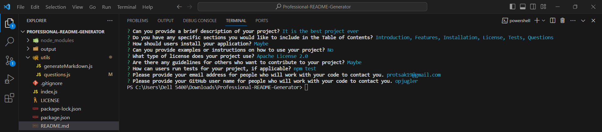

# Professional README Generator



## Description

The Professional README Generator is a Node.js application designed to assist users in creating professional README files through the command line interface (CLI). It utilizes Node.js, npm, and the inquirer package to prompt users with a series of questions and dynamically generate a comprehensive README file based on their responses.

### Watch Project Demo

- [Watch a video demonstration of the project on Google Drive](https://drive.google.com/file/d/1dT4Rru1oufd2HPBrC2OCD0WuBfakpCSG/view)

### Technologies Used

- JavaScript (Node.js)

### Dependencies

- Node.js
- NPM
- inquirer package

## Getting Started

1. Clone the GitHub repository:

   ```bash
   git clone https://github.com/OlehProtsak/Professional-README-Generator.git
   ```

2. Navigate to the project directory:

   ```bash
   cd Professional-README-Generator
   ```

3. Install dependencies using npm:

   ```bash
   npm install
   ```

4. Run the application:
   ```bash
   node index.js
   ```

## Usage

1. Answer the prompted questions in the command line interface.
2. The application will dynamically generate a README file based on your responses.
3. Find the generated README file in the "output" directory.

## Contribution

Contributions are not currently accepted for this project.

## Contact

For any inquiries or issues, please contact the project owner:

- [Oleh Protsak](https://github.com/OlehProtsak)
- Email: protsak19@gmail.com
